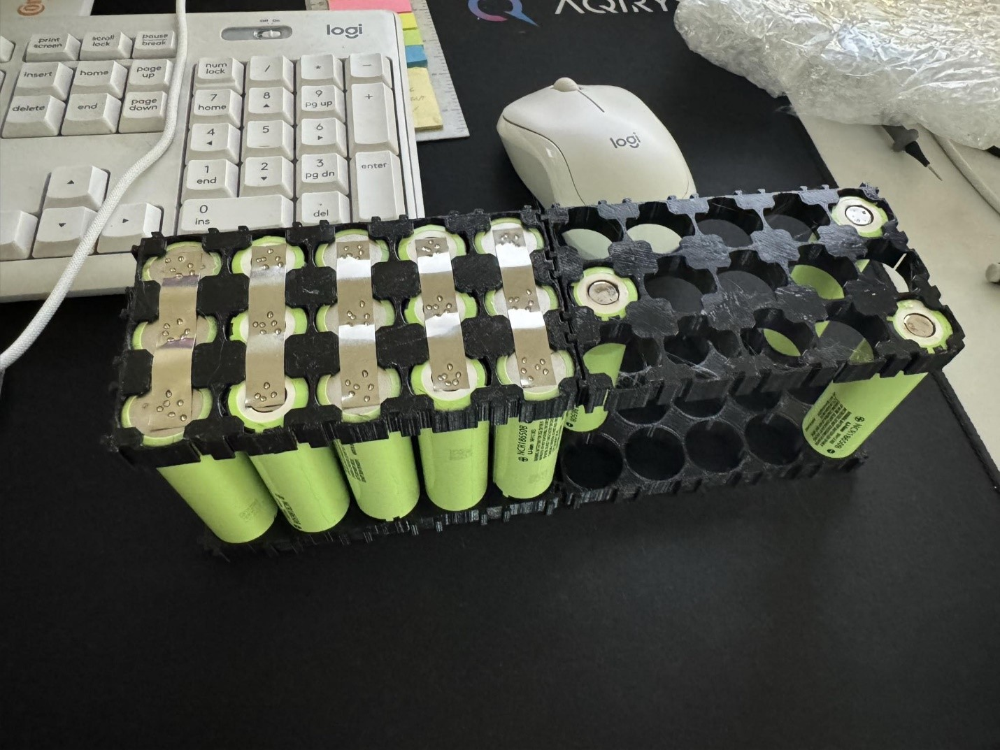
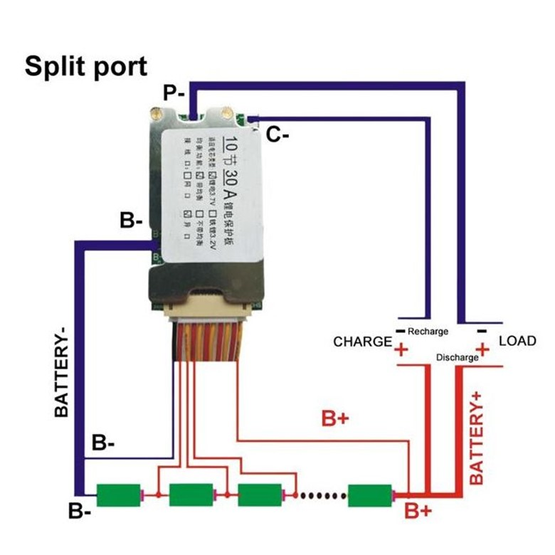
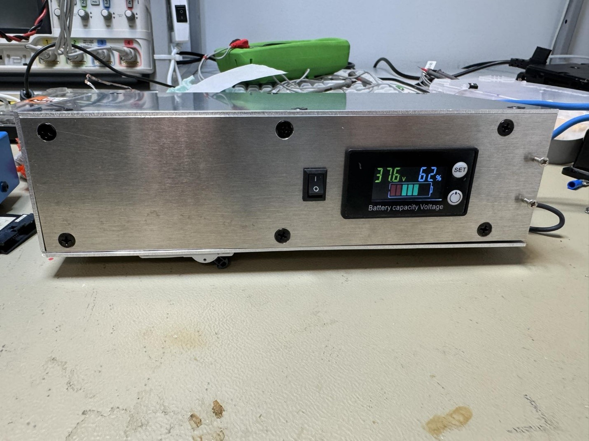
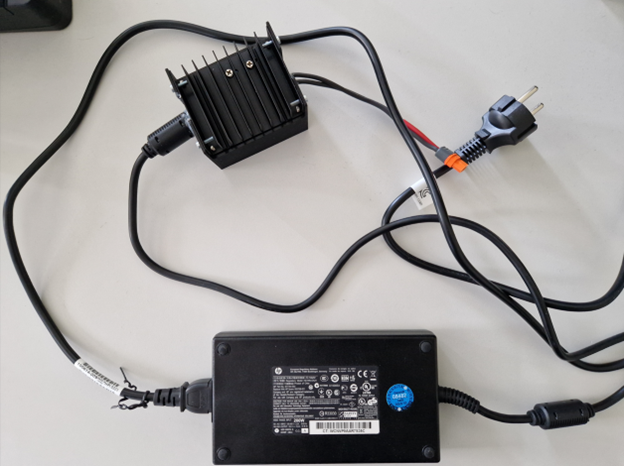

### [< back](../GuideForDocumentation.md)
# The Battery

### The battery pack that powers the robot consist of 30 Li-ION Panasonic NCR18650B cells. (cell characteristics: 3.6V 3350mAh 6.7A). The configuration of the battery is 10s3p. (10 series, 3 parallel). So the total nominal voltage is 36V, the total capacity is 10050 mAh and the maximum current is 20.1 A.

---

### The BMS that handles the battery pack is a generic one.

---

### In order to help with the heat dissipation we used Wurth thermally conductive material.
### To help with the monitoring of the state of the battery we use a generic display.
### Overcurrent protection is ensured by a Schneider Electric Easy9 circuit breaker.
### Overall protection is ensured by a case which is made at CNC from aluminum. 

---

### Charging of the battery pack is done using an old HP laptop charger (200W,  19.5V) together with a DC-DC 600W bust, to convert the voltage to 40v.

---

### Battery cell: https://www.emag.ro/acumulator-li-ion-panasonic-ncr18650b-3-6v-3350mah-6-7a-113408012/pd/DPP3K9BBM/?ref=history-shopping_365926684_8383_1
### BMS: https://www.sigmanortec.ro/modul-bms-10s-36v-30a-cu-balans-cu-radiator-termistor
### Charger: https://www.optimusdigital.ro/ro/surse-ridicatoare-reglabile/1688-modul-dc-dc-boost-de-600-w.html
### Thermally Conductive material: https://ro.farnell.com/wurth-elektronik/40113005/thermally-cond-material-silicone/dp/3779119?MER=BR-MER-MA-RECO-PDP-STM71775

### Display: https://www.sigmanortec.ro/modul-indicare-stare-baterie-de-panou-8-100vdc-cu-lcd
