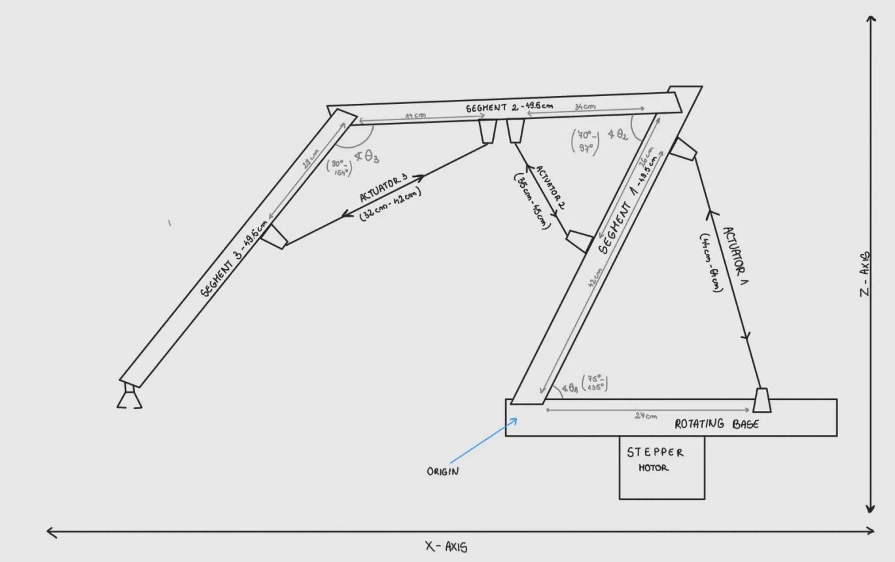

### [< back](../GuideForDocumentation.md)
# Arm positioning

---

To control the robotic arm, we separated its movement logic into **two** main components:
1. **Linear Movement** (up-down and front-back) – performed by the actuators.
2. **Rotational Movement** (left-right) – performed by the stepper motor.

---

We defined the **origin** at the point where the first segment is fixed onto the rotating base. 

**Coordinate System**

* **X-axis**: Front-Back
* **Y-axis**: Left-Right
* **Z-axis**: Up-down

---

## 1. Movement performed by the actuators

We identified and labeled each actuator and arm segment as follows:

* **Actuator 1**: Mounted furthest back, directly on the rotating base.
* **Actuator 2**: Mounted in the middle of the arm.
* **Actuator 3**: Mounted closest to the tip of the arm.
* **Segment 1**: Connected to the rotating base.
* **Segment 2**: The middle segment.
* **Segment 3**: The final segment, closest to the tip of the arm.

We defined the following angles:

* **θ₁**: Angle between Segment 1 and the rotating base.
* **θ₂**: Angle between Segment 1 and Segment 2.
* **θ₃**: Angle between Segment 2 and Segment 3.

---

To understand the range of motion of each actuator, we measured the side lengths of the triangles formed by the actuators and the bars they connect to. For each actuator, we recorded the dimensions when fully contracted and extended, and then used the **law of cosines** to calculate the corresponding **minimum and maximum angles** between the segments.

---

### Measurements

Each segment was measured to be approximately **49.5 cm** long.

**Triangle 1** (Actuator 1):

* **a** = 27 cm (vertical side, part of Segment 1)
* **b** = 44 cm (retracted actuator length), 64 cm (extended)
* **c** = 42 cm (horizontal side on the rotating base)

**Triangle 2** (Actuator 2):

* **a** = 26 cm (vertical side, part of Segment 1)
* **b** = 35 cm (retracted actuator length), 45 cm (extended)
* **c** = 34 cm (horizontal side, part of Segment 2)

**Triangle 3** (Actuator 3):

* **a** = 14 cm (part of Segment 2)
* **b** = 32 cm (retracted actuator length), 42 cm (extended)
* **c** = 29 cm (part of Segment 3)

**! Note: These measurements are approximate. The precision of the results can be improved with more accurate measurement tools.** 

---

### Angle ranges (in degrees)

Using the law of cosines, we calculated the angular ranges for each joint:

* **θ₁ (between Segment 1 and base):**
    * Min: 75°
    * Max: 135°
    * Range: ~60°

* **θ₂ (between Segment 1 and 2):**
    * Min: 70°
    * Max: 97°
    * Range: ~27°

* **θ₃ (between Segment 2 and 3):**
    * Min: 90°
    * Max: 154°
    * Range: ~64°

---

### Actuator potentiometer ranges

We also measured the potentiometer values for each actuator corresponding to their physical limits:

* **Actuator 1**:
    * Min: 37
    * Max: 790
    * Range: 753 units

* **Actuator 2**:
    * Min: 37
    * Max: 952
    * Range: 915 units

* **Actuator 3**
    * Min:29
    * Max 957
    * Range: 928 units

---

### Inverse kinematics method 

To determine the correct angles **(θ₁, θ₂, θ₃)** required for the end-effector to reach a specific **(x, z)** target position, we used the following approach:

1. **Brute-force angle generation:**
    We iterated through all possible angle combinations within the defined angular limits of each joint.

2. **Forward kinematics:**
    For each combination, we computed the position of the end-effector based on the known segment lengths and angles.

3. **Error minimization:**
    We stored all computed positions in a list and selected the angle set that produced the **smallest error** (i.e., closest match to the desired target point).

---

### Default arm configuration

For initialization, we defined a default position of the arm as follows:

* **Actuator 1:** Fully retracted (minimum length)
* **Actuator 2:** Fully extended
* **Actuator 3:** Fully extended

This starting pose serves as the rest position or reset state before performing new movements.

---

### Potentiometer Calibration: Degrees to Units

To control the actuators precisely, we determined the number of potentiometer units corresponding to **one degree** of angular movement for each actuator:

* **Actuator 1:** ~12.5 units/degree
* **Actuator 2:** ~33.9 units/degree
* **Actuator 3:** ~14.5 units/degree

This conversion factor allows us to translate desired joint angles into direct actuator commands.

---

### Conclusions - Positioning logic

This program solves the inverse kinematics problem efficiently by **precomputing all valid joint angle combinations** and their resulting positions. Instead of using expensive real-time calculations, it searches through this precomputed dataset. Trigonometric functions are optimized using **sine and cosine lookup tables** to avoid slow runtime evaluations. A **spatial grid** is used to index positions, allowing fast access to relevant configurations near a target point. This greatly reduces search time compared to a full linear scan. Angle values are discretized in fixed steps (e.g., 2°) to limit the size of the dataset while maintaining reasonable accuracy. The approach trades memory and setup time for fast and predictable execution during runtime.

