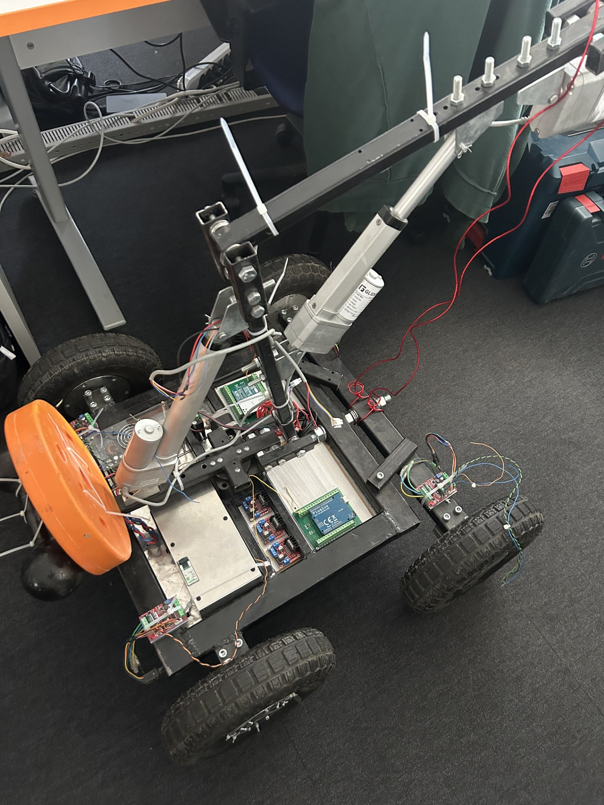
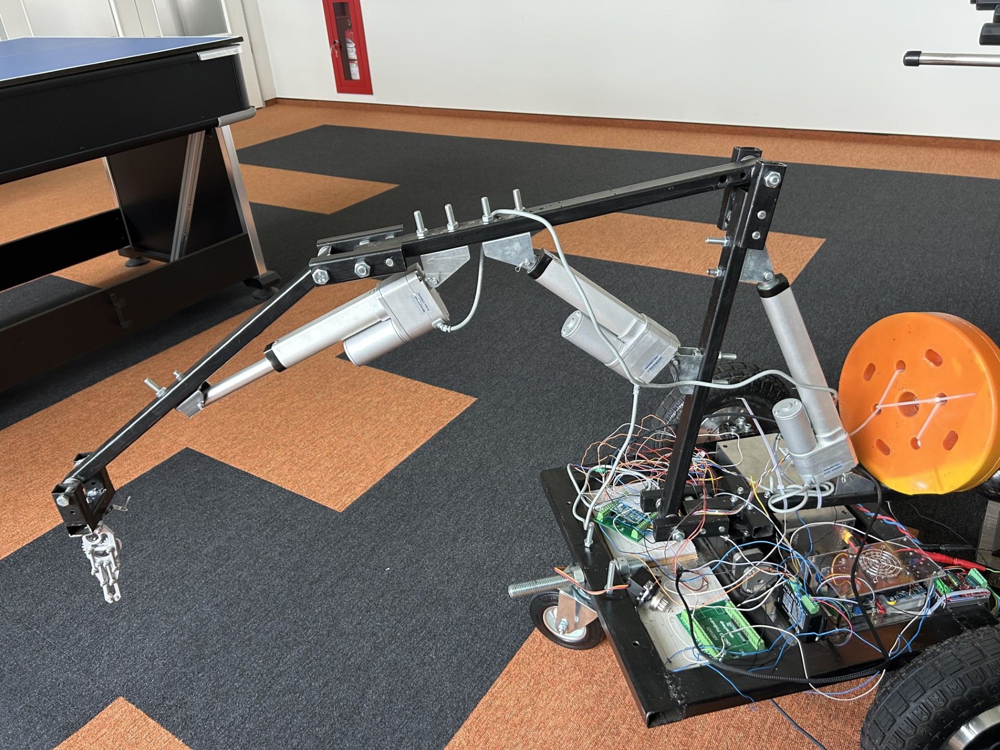

### [< back](../Home.md)

# Introduction

The main goal of this project was to build a **fully autonomous** vehicle capable of **detecting** and **avoiding** obstacles. Using one or more cameras, the system **identifies** objects on the ground, which are then picked up by the robotic arm.

Initially, we attempted to build a **four-wheeled** vehicle, with each wheel powered by its own motor. However, none of the axles were able to rotate, and the resulting friction prevented the vehicle from turning properly. As a result, we decided to remove the two front wheels and replace them with a single, freely rotating, non-motorized wheel.

