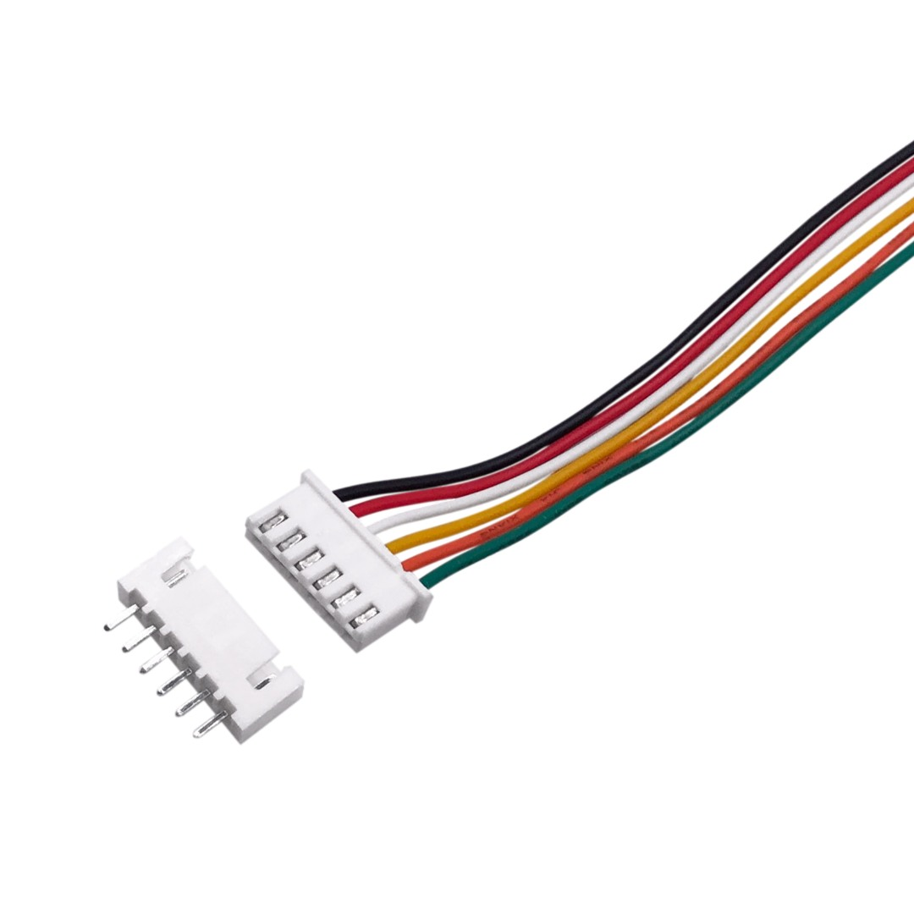

### [< back](./GuideForDocumentation.md)
# Improvements and Ideas

# Code
### Some parts require a rewrite, because right now it is pretty messy to add stuff on. Starting processes works really well, but sharing state and logic between them isn't abstracted.
### I would first work on better abstracting each component and writing a solid structure that's easy to add to.

---

### Another requirement is to have better error handling and display. We had the logs where we could see the errors, but we had no ideae where it occured.
### 1. Print traceback. This is done via the *traceback* module in Python. An example is in [arduino/arduino.py](../arduino/arduino.py) line 55.
### 2. A main log file would be nice to see where errors occured, without other details. This makes it so that you don't have to look through all logs to search for the error.

## Restart if failure
### In case of failure, right now the whole system shuts down. This could be desireable in some situations, but it would be good to try to restart the components that malfunctioned.

## Arduino
### Some commands require some time to finish and the Jetson might want to wait for them to finish before sending other commands. The best way to do this is to have commands on the arduino that return the state of an action (not started, in progress, finished) and any other partial data.

# Motors

## PID wheel velocities
### This would first require having data from the wheel sensors that isn't noisy and accurate. Apart from that, a way to visualize the current and target velocities in real time is necessary. We had this visualization on our webpage using the Google Chart API (but this one requires internet, maybe try another), but even something like python *matplotlib* could work.
### Then using *ArduinoPID* library tune it in real time an try to get accurate control.

## PID pose velocity
### You could use this controller alongside the previous, but this one might be simpler if you have pose data, but bad wheel velocity data.
### This basically uses 2 controllers: one for linear velocity and another for angular velocity. This then outputs feedforward pwm values, which is briefly explained in [this video](https://www.youtube.com/watch?v=Hgscy7m2fI4).

# Network
### We noticed that at times, the car wasn't responsive to our commands. We traced it back to the network being overloaded. This was due to the cameras sending large amounts of data, but also RVIZ was a problem.
### The camera issue was solved by resizing the image before sending, but it could further be reduced if needed.
### With RVIZ, it might be dependent on how frequent some topics are published. For example, when we increased the publish frequency of the local_costmap, the amount of data sent hogged the bandwidth.
### RVIZ is a good tool for debugging and is useful to run alongside the webpage control interface incase you want to press EMERGENCY. It is worth it to look into optimizing the network usage so all these tools can work concurrently.
### A possible solution would be to write your own visualization tool with only the required functionality, like we did in [/server/mapServer](../server/mapServer.py). We could see the map, but the pose wasn't working properly.

# Wiring
### A better solution for cable management needs to be implemented. Maybe with the use of PCBs and proper connectors like these JST-XH:

# SLAM
### Map update frequencies can be adjusted, because right now it responds very slowly to obstacles.
### Another problem is that the map becomes very noisy after some time. Obstacles that have moved aren't cleared, and a lot of black spots remain where the map should be unoccupied.
### Another problem is that the LIDAR only sees obstacles at a single height. It won't spot obstacles lower than the LIDAR (i.e. curbs) or things like the underside of tables. These types of obstacles need to be detected through other sensors (distance sensors, cameras etc.). Cameras provide the most flexibility as they have a higher FOV, but a solution for obstacle detection needs to be researched. With distance sensors you would need to place multiple ones to cover a larger area. Although, they could be good for certain deadspots.

# Remote connection
## Uploading Arduino code
### The code on the Jetson is easy to get; you just pull from git. But to upload to the Arduino you would have to pull out the cable, connect to the laptop and upload.
### A nice way to upload the code would be to do it remotely through the Jetson, that should be on the car and connected to the Arduinos.
### Arduino has a CLI tool for compiling and uploading code to the boards. This could be used to upload the code while ssh'd into the Jetson.
### You could go a step further (but this itself is a big project) and setup a Github pipeline where the Jetson automatically pulls changes from main and uploads the code to the Arduino. Or just write scripts for this.

# Camera and AI
## A better model
### The model we trained was hard to work with. It classified other objects as bottles and sometimes didn't see the bottles in the image.
### A different approach would be to try to find a better dataset, or to create your own dataset.

## Triangulation
### These means having two cameras see an object at the same time and calculating the object's position based on each camera's pixel coordinates.
### More info here: [https://en.wikipedia.org/wiki/Triangulation_(computer_vision)](https://en.wikipedia.org/wiki/Triangulation_(computer_vision))

# Chassis
### • To have the car turn in place and use all four wheels, the wheels would need to be closer together.
### • Even with the same pwm on both wheels, the car seems to turn a little. This could be because of the caster wheel or the wheels need a PID controller to properly have the same speed.
### • The claw's rotation servo could be replaced with a more powerful one.
### • The arm's end effector could be replaced with a vaccum grabber (it's simpler to grab things).